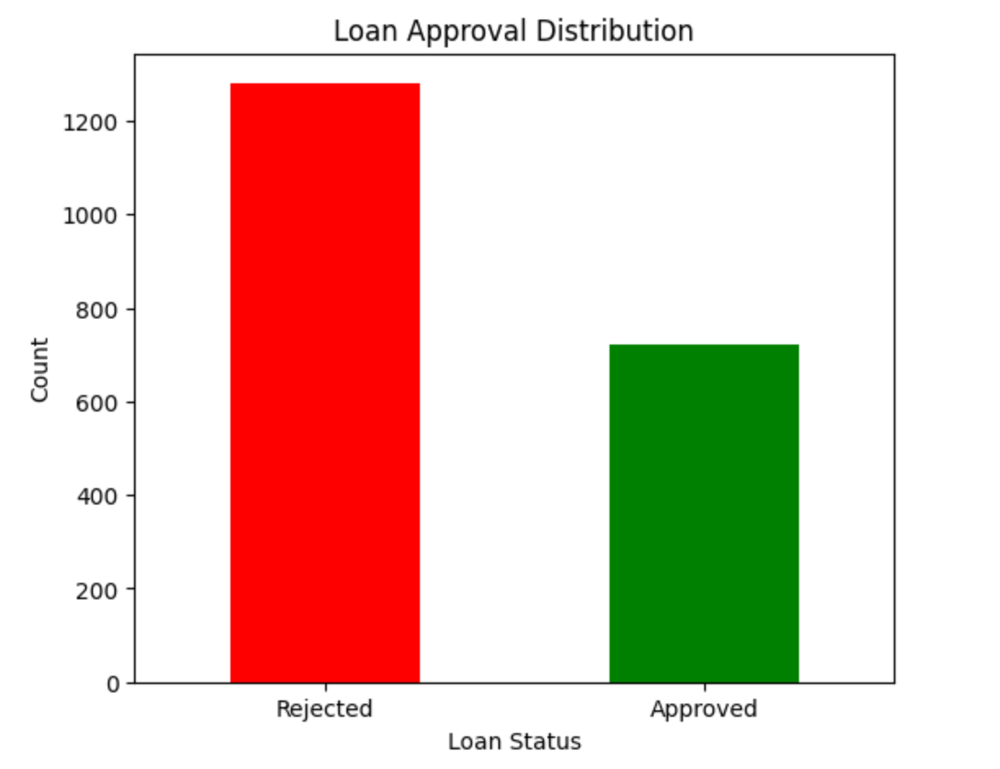
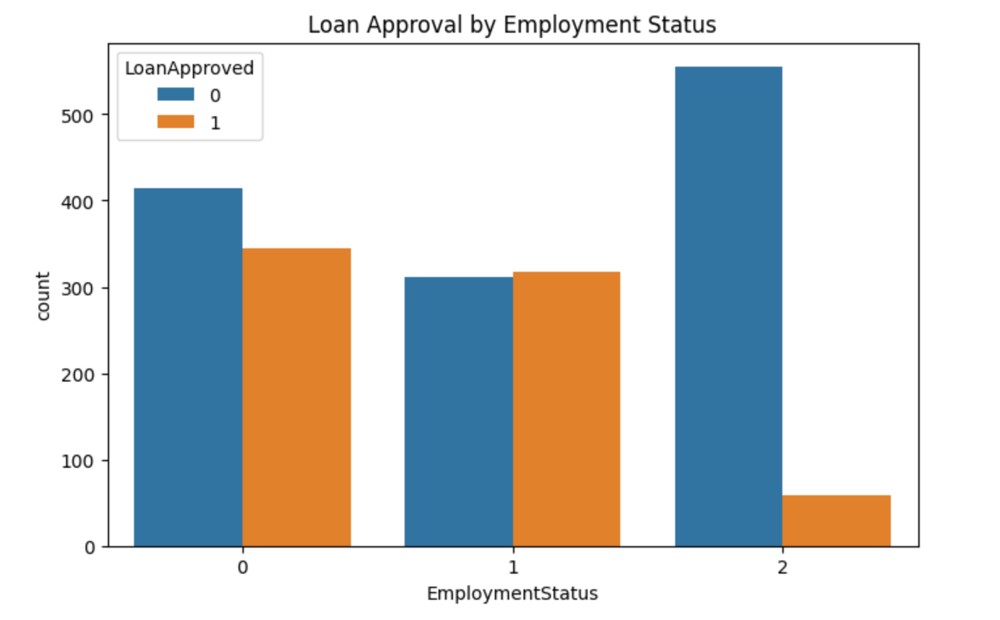
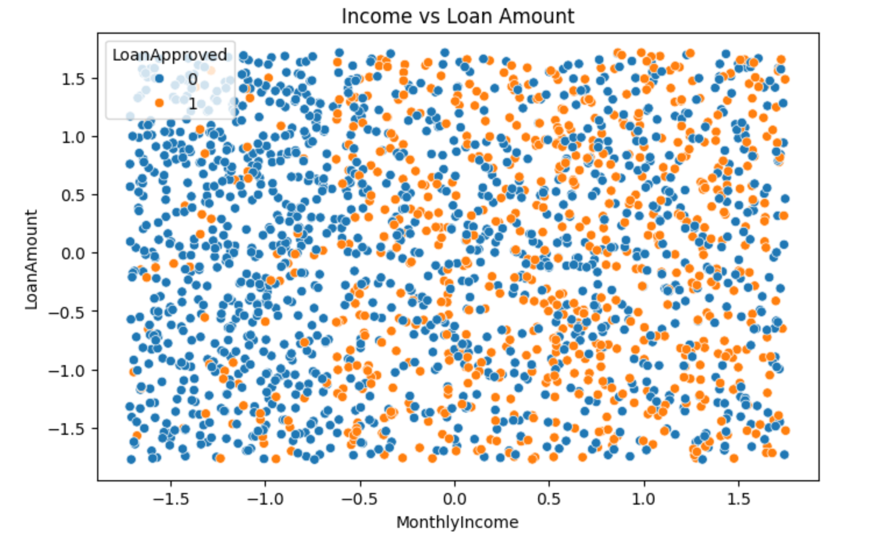
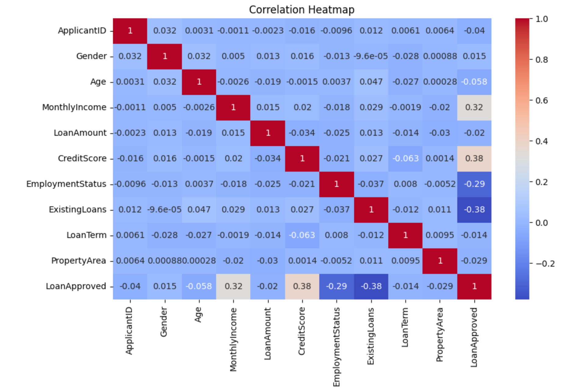
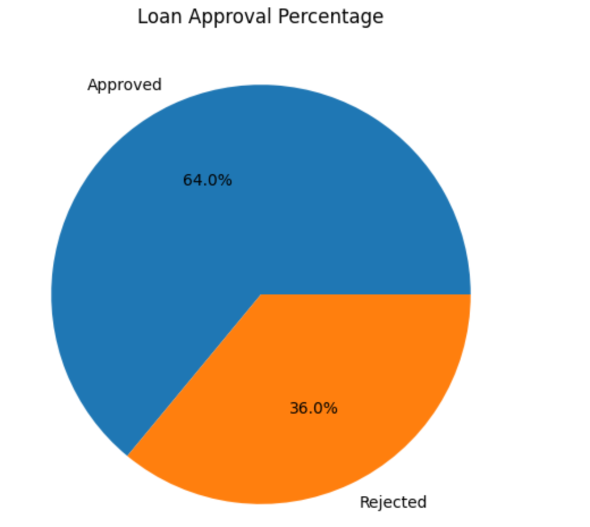
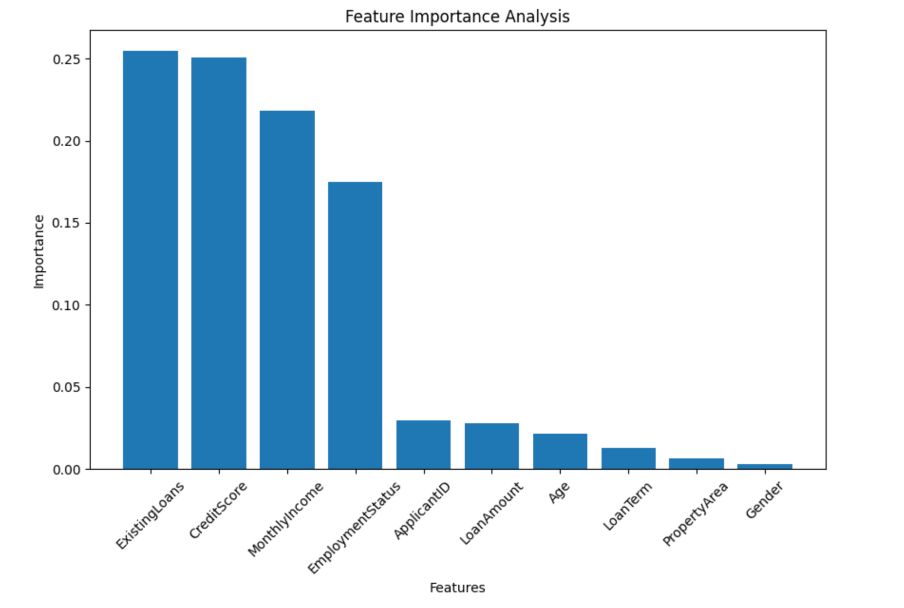
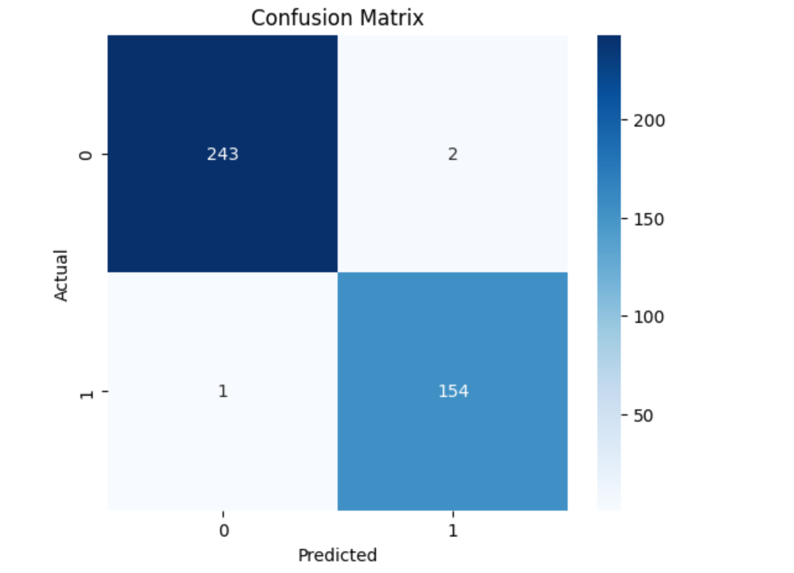

# Loan Approval Prediction Project

## Project Overview

This project predicts whether a loan application should be approved or rejected using Machine Learning techniques.

The project includes:
- Synthetic dataset generation
- Data preprocessing
- Exploratory Data Analysis (EDA)
- Data visualization
- Machine Learning model training
- Interactive prediction system

---

## Dataset Features

- ApplicantID
- Gender
- Age
- MonthlyIncome
- LoanAmount
- CreditScore
- EmploymentStatus
- ExistingLoans
- LoanTerm
- PropertyArea
- LoanApproved

---

## Technologies Used

- Python
- Pandas
- NumPy
- Matplotlib
- Seaborn
- Scikit-learn
- Jupyter Notebook

---

## Machine Learning Algorithm

- Random Forest Classifier

---

## Model Evaluation Metrics

- Accuracy Score
- Precision
- Recall
- F1 Score
- Confusion Matrix

---

## Key Insights

- Higher credit scores improve loan approval chances.
- Applicants with higher income are more likely to get approval.
- Unemployed applicants face more rejections.
- Existing loans negatively affect approval probability.

---

## How to Run

### 1. Clone the repository

```bash
git clone https://github.com/Sudipta-I-am/Loan_Approval_Prediction_Project.git
```

### 2. Open project folder

```bash
cd Loan_Approval_Prediction_Project
```

### 3. Install required libraries

```bash
pip install -r requirements.txt
```

### 4. Run Jupyter Notebook

```bash
jupyter notebook
```

### 5. Run prediction system

```bash
python prediction_system.py
```
## Model Comparison

| Model | Accuracy |
|---|---|
| Logistic Regression | 86.75% |
| Decision Tree | 99.00% |
| Random Forest | 99.25% |
## Visualizations

## Visualizations

### Loan Approval Distribution


---

### Loan Approval by Employment Status


---

### Income vs Loan Amount


---

### Correlation Heatmap


---


### Loan Approval Distribution


---

### Feature Importance


---

### Confusion Matrix

